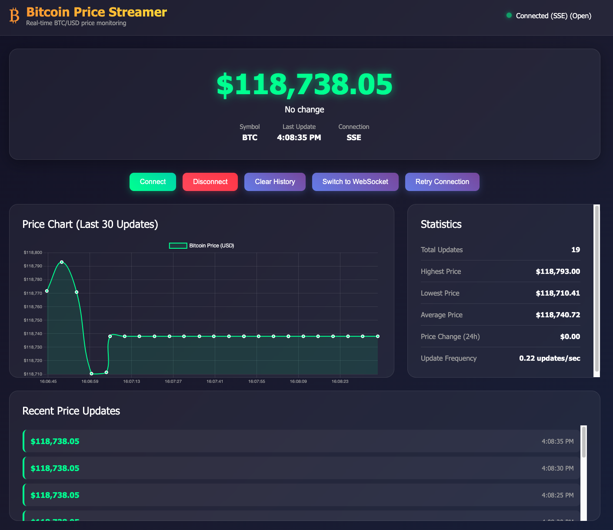

# Bitcoin Price Streamer



A real-time Bitcoin price streaming service built in Go that fetches BTC/USD prices from the CoinDesk API and streams them to connected clients using Server-Sent Events (SSE).

## Features

- **Real-time Price Streaming**: Fetches Bitcoin price from CoinDesk API every 5 seconds
- **Server-Sent Events (SSE)**: Streams live price updates to all connected clients
- **Missed Updates Recovery**: Clients can reconnect and receive missed updates using the `since` parameter
- **In-Memory Storage**: Uses a ring buffer for efficient storage of recent price updates
- **Concurrent Client Management**: Handles multiple client connections using Go's concurrency model
- **Web Frontend**: Responsive UI for visualizing live price updates
- **Docker Support**: Containerized application for easy deployment
- **WebSocket Support**: Alternative real-time communication protocol
- **REST API**: Additional endpoints for current price and price history

## API Endpoints

### Real-time Streaming
- `GET /api/price/stream` - Server-Sent Events stream
- `GET /api/ws` - WebSocket connection

### REST API
- `GET /api/price/current` - Get current Bitcoin price
- `GET /api/price/history` - Get price history with optional filtering
  - Query parameters:
    - `since` - Unix timestamp to get updates since
    - `limit` - Maximum number of updates to return (default: 100)

### Frontend
- `GET /` - Web interface for live price visualization

## Environment Variables

The following environment variables can be configured:

- `COINDESK_API_URL` - CoinDesk API endpoint (default: `https://data-api.coindesk.com/asset/v1/top/list`)
- `PORT` - Server port (default: `8080`)
- `LOG_LEVEL` - Logging level (default: `info`)
- `CLIENT_BUFFER_SIZE` - Buffer size for client channels (default: `50`)
- `STORAGE_CAPACITY` - Number of price updates to store in memory (default: `1000`)

## Quick Start

### Prerequisites
- Go 1.21 or later
- Git

### Local Development

1. Clone the repository:
```bash
git clone <repository-url>
cd bitcoin-price-streamer
```

2. Install dependencies:
```bash
go mod tidy
```

3. Run the application:
```bash
go run main.go
```

4. Open your browser and navigate to `http://localhost:8080`

### Using Docker

1. Build the Docker image:
```bash
docker build -t bitcoin-price-streamer .
```

2. Run the container:
```bash
docker run -p 8080:8080 bitcoin-price-streamer
```

3. Open your browser and navigate to `http://localhost:8080`

## API Usage Examples

### Server-Sent Events (SSE)
```javascript
const eventSource = new EventSource('/api/price/stream');

eventSource.addEventListener('price', (event) => {
    const priceData = JSON.parse(event.data);
    console.log('New price:', priceData);
});

// With missed updates recovery
const since = Math.floor(Date.now() / 1000) - 300; // 5 minutes ago
const eventSource = new EventSource(`/api/price/stream?since=${since}`);
```

### WebSocket
```javascript
const ws = new WebSocket('ws://localhost:8080/api/ws');

ws.onmessage = (event) => {
    const priceData = JSON.parse(event.data);
    console.log('New price:', priceData);
};
```

### REST API
```bash
# Get current price
curl http://localhost:8080/api/price/current

# Get price history
curl http://localhost:8080/api/price/history

# Get price history with filtering
curl "http://localhost:8080/api/price/history?since=1640995200&limit=50"
```

## Architecture

The application follows a clean architecture pattern with the following components:

- **Models** (`internal/models/`): Data structures for price updates and API responses
- **Storage** (`internal/storage/`): In-memory storage with ring buffer
- **Service** (`internal/service/`): Business logic for price fetching and client management
- **Handlers** (`internal/handlers/`): HTTP request handlers for different endpoints

### Key Features

1. **Ring Buffer Storage**: Efficient in-memory storage with automatic cleanup of old data
2. **Concurrent Client Management**: Uses Go channels for thread-safe client communication
3. **Missed Updates Recovery**: Clients can request updates since a specific timestamp
4. **Graceful Shutdown**: Proper cleanup of resources on application shutdown
5. **Error Handling**: Comprehensive error handling and logging

## Data Structure

The application fetches data from the CoinDesk API and extracts Bitcoin-specific information:

```json
{
  "timestamp": "2024-01-15T10:30:00Z",
  "price": 118738.05,
  "symbol": "BTC",
  "name": "Bitcoin"
}
```

## Production Readiness

### Scaling to 10,000+ Concurrent Users

- **Horizontal Scaling**: Deploy multiple instances behind a load balancer (nginx/HAProxy)
- **Connection Pooling**: Use Redis for shared client state across instances
- **Database Storage**: Replace in-memory storage with Redis/PostgreSQL for persistence
- **Microservices**: Split into separate services (price-fetcher, client-manager, storage)
- **CDN**: Use CloudFlare/AWS CloudFront for static assets and API caching
- **Auto-scaling**: Implement Kubernetes HPA or AWS Auto Scaling Groups

### Reliability, Fault-Tolerance, and Observability

- **Health Checks**: Add `/health` endpoint with liveness/readiness probes
- **Circuit Breakers**: Implement for external API calls to CoinDesk
- **Retry Logic**: Exponential backoff for failed API requests
- **Monitoring**: Prometheus metrics + Grafana dashboards for client count, API latency, error rates
- **Logging**: Structured logging with correlation IDs and log aggregation (ELK stack)
- **Alerting**: Set up alerts for high error rates, connection drops, API failures
- **Graceful Degradation**: Fallback to cached data when external API is unavailable
- **Backup Strategies**: Multi-region deployment with failover mechanisms

## License

This project is licensed under the MIT License. 